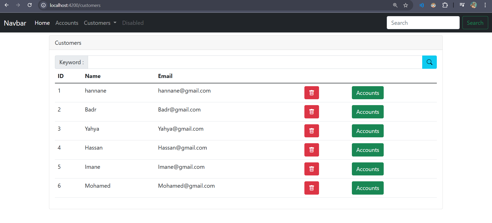
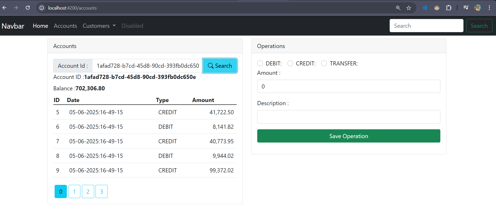

# Banque Digitale - Frontend et Backend

Ce projet regroupe une API REST développée avec **Spring Boot** et une application Angular servant d'interface web. Il illustre la gestion d'une banque en ligne avec la possibilité de consulter et d'administrer différents comptes.

## Présentation

L'application propose un tableau de bord où l'utilisateur peut suivre ses comptes courants et d'épargne. Des opérations de crédit ou de débit peuvent être réalisées directement depuis l'interface. Chaque transaction est enregistrée afin de fournir un historique clair.

### Fonctionnalités
- Visualisation des soldes en temps réel
- Liste détaillée des opérations effectuées
- Réalisation de virements entre comptes
- Recherche par nom de client ou numéro de compte

## Architecture

- **digital-banking-spring-backend** : expose l'API et gère l'accès à la base de données.
- **digital-banking-angular-front** : consomme cette API et présente les informations à l'utilisateur.

## Prérequis

- **Node.js** et **npm** pour exécuter l'interface Angular.
- **Java 21** et **Maven** (ou le wrapper `mvnw`) pour le backend Spring Boot.
- **MySQL** installé via **XAMPP** pour la base de données.

## Installation

1. Cloner le dépôt.
2. Démarrer MySQL depuis **XAMPP**.
3. Installer les dépendances du frontend :
   ```bash
   cd digital-banking-angular-front
   npm install
   ```
4. Lancer le backend :
   ```bash
   cd ../digital-banking-spring-backend
   ./mvnw spring-boot:run
   ```
5. Dans un autre terminal, démarrer l'application Angular :
   ```bash
   cd ../digital-banking-angular-front
   npm start
   ```

## Captures d'écran

Quelques exemples de l'interface :

1. Liste des comptes:
   


2. Détail d'un compte:
   


## Tests

Pour vous assurer que tout fonctionne correctement, vous pouvez lancer les tests unitaires :

```bash
cd digital-banking-spring-backend
./mvnw test

cd ../digital-banking-angular-front
npm test -- --watch=false
```

